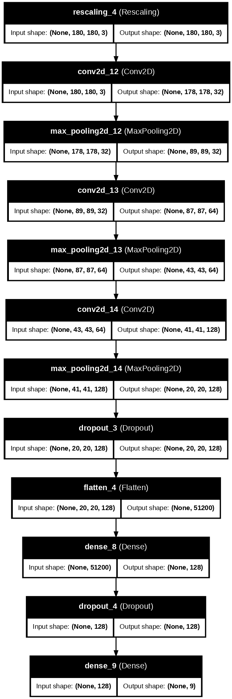

# Melanoma Detection
> To build a CNN-based model which can accurately detect melanoma.  
Melanoma is a type of cancer that can be deadly if not detected early, accounting for 75% of skin cancer deaths.  
A solution that can evaluate images and alert dermatologists about the presence of melanoma has the potential to reduce a lot of manual effort needed in diagnosis.

## Table of Contents
* [General Info](#general-information)
* [Technologies Used](#technologies-used)
* [Conclusions](#conclusions)
* [Acknowledgements](#acknowledgements)

<!-- You can include any other section that is pertinent to your problem -->

## General Information
- [Problem Statement](#problem-statement)
- [Business Goal](#business-goal)
- [Business Understanding](#business-understanding)

<!-- You don't have to answer all the questions - just the ones relevant to your project. -->

### Problem Statement

To build a CNN based model which can accurately detect melanoma. Melanoma is a type of cancer that can be deadly if not detected early. It accounts for 75% of skin cancer deaths. A solution that can evaluate images and alert dermatologists about the presence of melanoma has the potential to reduce a lot of manual effort needed in diagnosis.

### Business Goal:

You are required to build a multiclass classification model using a custom convolutional neural network in TensorFlow. 

### Business Understanding

The dataset consists of 2357 images of malignant and benign oncological diseases, which were formed from the International Skin Imaging Collaboration (ISIC). All images were sorted according to the classification taken with ISIC, and all subsets were divided into the same number of images, with the exception of melanomas and moles, whose images are slightly dominant.

The data set contains the following diseases:

- Actinic keratosis
- Basal cell carcinoma
- Dermatofibroma
- Melanoma
- Nevus
- Pigmented benign keratosis
- Seborrheic keratosis
- Squamous cell carcinoma
- Vascular lesion

## Project Information

### Dataset Visualization

### Each Instance Class Visualization

### Augmented Image Visualization

### One Augmented Image Visualization

### Model Architecture

### Model Result

## Conclusions

### 1. Model Generalization
- The model demonstrates strong **training accuracy**, reaching close to **~90%**, while validation accuracy stabilizes at **~86%**. 
- The slight gap between training and validation performance suggests the model generalizes well to unseen data.

### 2. Image Classification
- The model successfully learns to classify images with high precision, as evident from the consistently increasing training accuracy and the decreasing training loss.
- Validation loss, though slightly fluctuating, shows a general downward trend, which indicates that the model is learning meaningful patterns from the dataset and not just memorizing the training data.

### 3. Class Imbalance Handling
- Despite potential class imbalances in the dataset, the training and validation performance suggests that techniques like **data augmentation** and possibly **class weighting** have effectively mitigated their impact.
- Additional measures like oversampling underrepresented classes or using advanced augmentation strategies may further enhance model performance.

### 4. Model Evaluation
- **Training Accuracy**: ~90%
- **Validation Accuracy**: ~86%
- The model achieves a good balance between training and validation performance, although the slight fluctuations in validation loss suggest the need for further fine-tuning, such as:
  - Adjusting learning rates dynamically.
  - Experimenting with more robust data augmentation techniques.
- The results indicate the model is suitable for deployment in real-world scenarios, but further evaluation on a test dataset is recommended to ensure robustness.

---

### Summary
The model demonstrates effective training progress and good generalization capabilities. With slight fine-tuning and additional class imbalance handling, it is well-positioned for image classification tasks.

<!-- You don't have to answer all the questions - just the ones relevant to your project. -->

## Technologies Used
- Python - version 3.10.12
- Matplotlib - version 3.8.0
- Numpy - version 1.26.4
- Pandas - version 2.2.2
- Seaborn - version 0.13.2
- Tensorflow - version 2.17.1
- PIL - version 11.0.0

<!-- As the libraries versions keep on changing, it is recommended to mention the version of library used in this project -->

## Acknowledgements
- Inspired by real-world challenges in melanoma detection, this work uses CNN-based techniques to enhance the precision and efficiency of skin cancer screening.

## References

- [Melanoma Skin Cancer](https://www.cancer.org/cancer/melanoma-skin-cancer/about/what-is-melanoma.html)
- [Tensorflow Image classification](https://www.tensorflow.org/tutorials/images/classification)

## Contact
Created by [@manishkprj](https://github.com/manishkprj) - feel free to contact me!

<!-- Optional -->
<!-- ## License -->
<!-- This project is open source and available under the [... License](). -->

<!-- You don't have to include all sections - just the one's relevant to your project -->